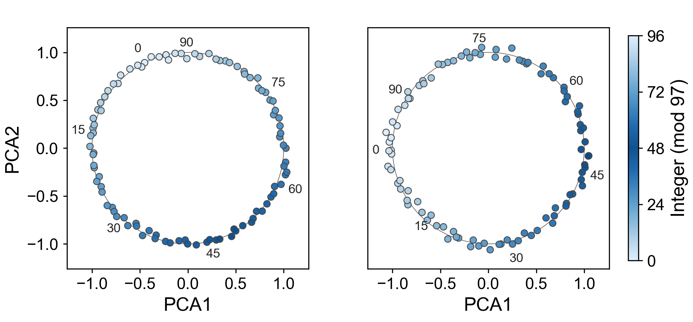
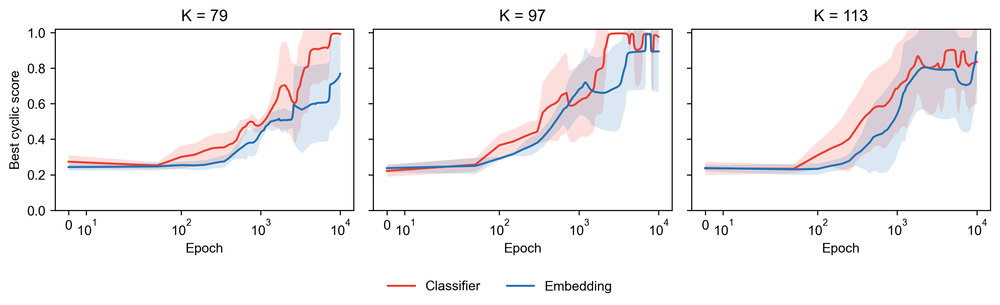
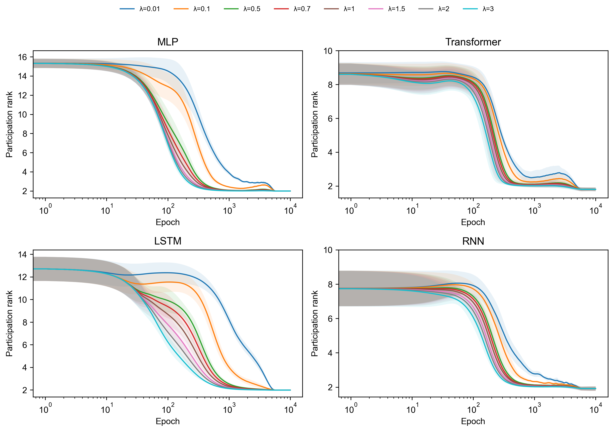
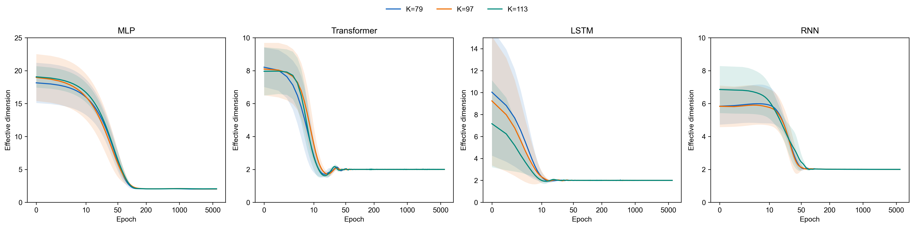
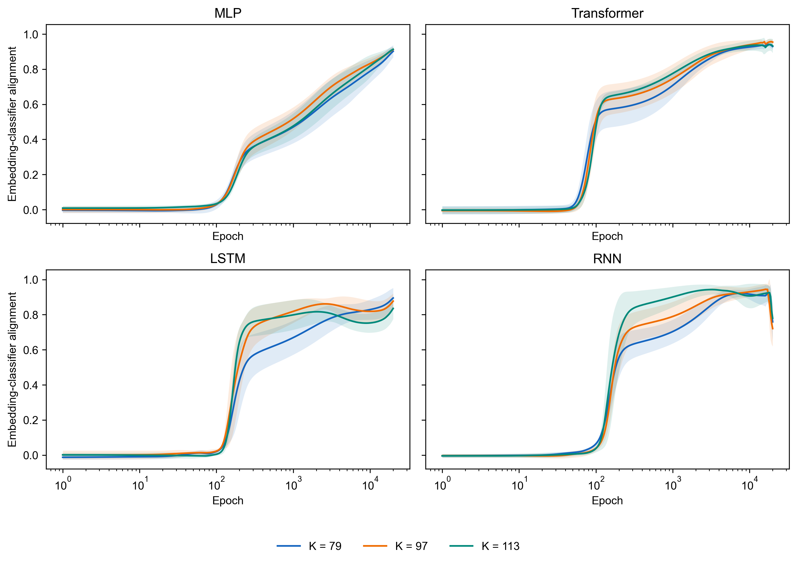
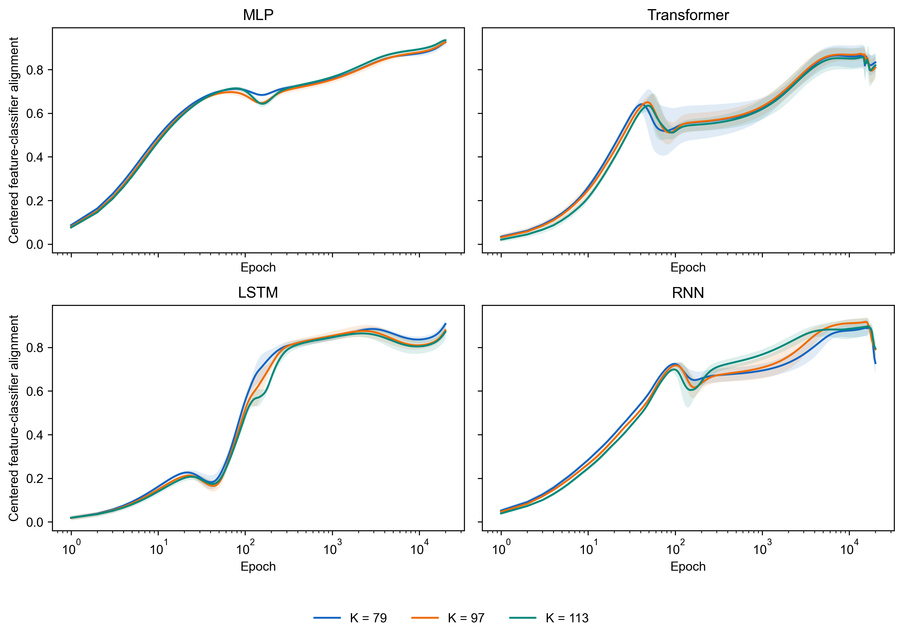

# Beyond Neural Collapse: reproducibility repository

This repository accompanies the accepted TMLR paper *Beyond Neural Collapse:
Task-Intrinsic Geometry Governs Neural Representations in Modular Arithmetic*.
It provides audited configurations, a unified training interface, metric and
plotting implementations, compact paper data, tests, and provenance records.
Historical one-off scripts are retained for audit only; the reusable package
lives under `src/bnc_repro/`.

## Documentation map

- [Tutorials](Tutorials/README.md): choose a path from a five-minute check
  to a formal GPU reproduction.
- [Reproduction status](REPRO_STATUS.md): what is ready, partial, or blocked.
- [Experiment matrix](docs/experiment_matrix.md): architectures, moduli, seeds,
  schedules, and defining hyperparameters.
- [Metric definitions](docs/metric_definitions.md): exact numerical contracts.
- [CLI reference](docs/cli_reference.md): arguments, inputs, and outputs.
- [Data manifest](docs/data_manifest.md): supplied files and row counts.
- [Known discrepancies](docs/known_discrepancies.md): missing artifacts and
  intentional differences.
- [Source audit](docs/source_audit.md): provenance of consolidated code.

## What is reproducible now

| Target | Train code | Supplied data | Data-only plot |
|---|---:|---:|---:|
| Figure 1, mod-97 PCA | Yes | PNG + metrics only | Blocked: coordinates/checkpoint absent |
| Figure 2, tuned MLP | Yes | Raw + aggregate | Yes |
| Figure 2, all four architectures | Yes | MLP only | Blocked: other-architecture aggregate absent |
| Figure S1, rank-homotopy | Yes | Raw + aggregate | Yes |
| Figure S2, rank-2 effective dimension | Yes | Raw + aggregate | Yes |
| Figure S3, token/classifier alignment | Yes | Aggregate | Yes |
| Figure S4, centered feature/classifier alignment | Yes | Raw + aggregate | Yes |

Blocked states are deliberate. The repository never fabricates missing
coordinates, checkpoints, or aggregate tables. See
[REPRO_STATUS.md](REPRO_STATUS.md) and
[docs/known_discrepancies.md](docs/known_discrepancies.md).

## Tutorials

| Tutorial | Use it when | Cost |
|---|---|---|
| [Five-minute start](Tutorials/01_five_minute_start.md) | Verify installation and bundled data | CPU, no training |
| [Bundled data and figures](Tutorials/02_bundled_data_and_figures.md) | Recreate available paper plots with provenance | CPU, no training |
| [CPU smoke](Tutorials/03_cpu_smoke.md) | Test every model family end to end | CPU, two epochs |
| [Configured training](Tutorials/04_training.md) | Launch a bounded or formal configured run | CPU or GPU |
| [Figure recipes](Tutorials/05_figure_recipes.md) | Reproduce one named target | Varies |
| [Outputs and aggregation](Tutorials/06_outputs_and_aggregation.md) | Inspect or combine run directories | CPU after training |
| [Python API](Tutorials/07_python_api.md) | Call metrics in another program | CPU |
| [Troubleshooting](Tutorials/08_troubleshooting.md) | Diagnose a command, CUDA, checkpoint, or remote-session failure | Diagnostic |

Runnable examples live under [`examples/`](examples/README.md).

## Paper figures

Versioned figure files are stored under `figures/paper_data/`; each reproducible plot is provided as PNG, vector PDF, and SVG. The Figure 1 image is the reference artifact supplied with the original experiment bundle. Figure 2 is labeled MLP-only because the other-architecture aggregate tables were not supplied.

| Figure | Preview |
|---|---|
| Figure 1 reference |  |
| Figure 2, MLP-only |  |
| Figure S1 |  |
| Figure S2 |  |
| Figure S3 |  |
| Figure S4 |  |

See `figures/README.md` for provenance and availability details.

## Requirements

- Python 3.10 or newer
- PyTorch 2.1 or newer
- NumPy, pandas, Matplotlib, and PyYAML
- A CUDA-capable environment only for formal experiment grids

The data-only validation and plotting paths do not require a GPU. The supplied
archives do not include an approved software license; read
[LICENSE_PENDING.md](LICENSE_PENDING.md) before redistribution.

## Usage

The sequence below mirrors the repository's actual dependency order. Run all
commands from the repository root.

### Step 1: Install the package

```bash
python -m venv .venv
# Linux/macOS: source .venv/bin/activate
# Windows PowerShell: .venv\Scripts\Activate.ps1
python -m pip install --upgrade pip
python -m pip install -e ".[dev]"
```

### Step 2: Validate the supplied paper data

```bash
python -m bnc_repro.cli validate --figure all
```

This checks defining row counts, schedules, seeds, moduli, architectures, and
metadata contracts. Figure 1 returning `reference-artifact-only` and the full
Figure 2 plot returning a blocked state are expected.

### Step 3: Recreate every available data-only figure

```bash
python scripts/plot_all_paper_data.py
```

Outputs are written to `figures/paper_data/` as PNG, PDF, and SVG. The command
also writes `plot_status.json` with explicit blocked reasons.

### Step 4: Run the four-architecture CPU smoke test

```bash
python scripts/run_smoke.py --output outputs/smoke
```

This trains MLP, Transformer, LSTM, and RNN for two epochs on K=17, then
aggregates and plots two alignment metrics. It verifies the pipeline; it is not
evidence for a paper claim.

### Step 5: Train a configured grid

```bash
python -m bnc_repro.cli train \
  --config configs/fig_s3/token_geometry_20k.yaml \
  --output outputs
```

Formal configs are expensive and the core package does not currently implement
resume. Read [compute requirements](docs/compute_requirements.md), run the CPU
smoke, and use a scheduler or terminal multiplexer for remote process lifetime.

### Step 6: Aggregate and plot custom runs

```bash
python -m bnc_repro.cli aggregate \
  --figure fig_s3 \
  --runs-root outputs/fig_s3 \
  --output outputs/fig_s3_summary.csv

python -m bnc_repro.cli plot \
  --figure fig_s3 \
  --data outputs/fig_s3_summary.csv \
  --output figures/custom/fig_s3
```

Formal profiles validate selected experiment-specific grids and key
hyperparameters, including the authoritative S2 regularizer values. They do
not currently bind protocol names or architecture lists. Treat `formal: true`
as a guardrail, not a complete immutability guarantee, and review the YAML
before every run.

## Experiment notes

- All tasks use the ordered modular-addition grid `(x, y) -> (x + y) mod K` and preserve the seeded train/test indices.
- Classifier rows and columns are converted explicitly through the common model interface. MLP uses role-specific, bias-free `W_x`, `W_y`, `W`, and `W_U`; Transformer and recurrent models use an independent classifier head.
- Figure 2 uses the exact July 2026 best cyclic score (BCS), including PCA, RMS normalization, unit-circle projection, automorphisms of `Z_K`, and both orientations.
- S1 and S2 are initialized from dense checkpoints. The supplied archives intentionally omitted checkpoints, so a full rerun must first generate the dense checkpoint grid with `configs/dense/s1_s2_dense_checkpoints.yaml`.
- S1/S2 raw tables are gzip-compressed. pandas reads them directly with `pd.read_csv("...csv.gz")`.

See [docs/experiment_matrix.md](docs/experiment_matrix.md), [docs/metric_definitions.md](docs/metric_definitions.md), and [docs/compute_requirements.md](docs/compute_requirements.md) before launching a formal sweep.

## Repository layout

- `src/bnc_repro/`: reusable models, protocols, metrics, aggregation, plotting, validation, and CLI.
- `configs/`: formal manuscript profiles plus a CPU smoke profile.
- `scripts/`: one-command figure, validation, plotting, and smoke wrappers.
- `paper_data/`: compact supplied data with a `metadata.json` in each figure directory.
- `experiments/`: tuning audit and selected server-latest source snapshots; not imported by the core package.
- `tests/`: numerical invariance, schedule, model-interface, data-contract, and plotting tests.
- `docs/`: tutorials, CLI/contracts, audits, and provenance.
- `examples/`: small runnable Python API demonstrations.

The migration of every `.py` file from the 15 experiment archives is recorded in [MIGRATION_MAP.md](MIGRATION_MAP.md).

## Citation and contribution

Please cite the associated paper when using this repository. The supplied
archive did not contain verified author/DOI metadata, so this repository does
not invent a citation record; add one only after checking the final paper
record. Contributions should preserve audited configuration and data
contracts; read [CONTRIBUTING.md](CONTRIBUTING.md) before opening a change.
